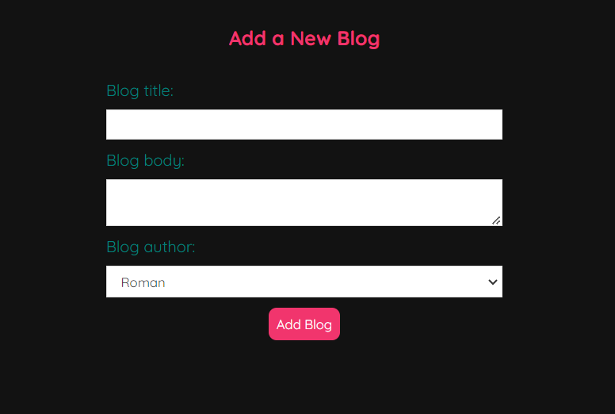

# React Blog App


This is a [React](https://react.dev/) based blog application where users can read existing blogs, add their own blogs, delete them when necessary, and change themes between light and dark modes.


## Features:
- **Read Blogs**: Browse through existing blogs with ease.
- **Add Blogs**: Share your thoughts and stories by adding new blogs.
- **Delete Blogs**: Remove blogs that are no longer needed.
- **Change Themes**: Toggle between light and dark themes for a personalized experience.


## Tech Stacks:

- **Framework**: React.js
- **Language**: Javascript
- **Styling**: CSS
- **Navigation**: React Router


## App In Action:



- **Add Blog**


- **Read Blogs**


## Setup:


1. Clone the repository:

   ```bash
   git clone https://github.com/yourusername/react-blog-app.git
   cd react-blog-app

2. Install dependencies:

   ```bash
   npm install


## Running the Application:

1. Start the development server:

   ```bash
   npm start

2. Open your browser and visit http://localhost:3000 to view the app.